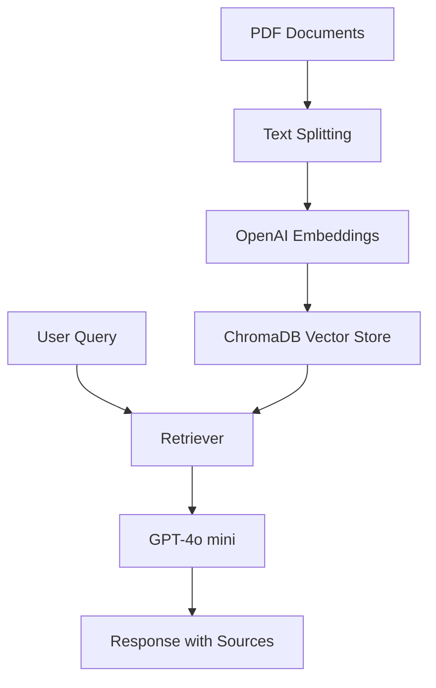

# 🤖 AI Document Chatbot - RAG Engine

[](https://www.python.org/)
[](https://langchain.com/)
[](https://gradio.app/)
[](https://opensource.org/licenses/MIT)

An advanced **Retrieval-Augmented Generation (RAG)** system built with LangChain, OpenAI, and ChromaDB. This application allows you to upload multiple PDF documents, process them into a vector database, and interact with them through a modern web interface.

---

## ✨ Key Features

- 📄 **Multi-PDF Support** - Upload and process multiple documents simultaneously.
- ✂️ **Smart Chunking** - Intelligent text splitting (1000 characters with 200 overlap) for better context retention.
- 🔍 **Vector Search** - Semantic search powered by **OpenAI Embeddings** and **ChromaDB**.
- 💬 **Contextual Chat** - Conversational AI using **GPT-4o-mini** with full chat history memory.
- 📊 **Embedding Visualization** - Interactive 2D t-SNE projection of your document chunks using **Plotly**.
- 📚 **Source Tracking** - Every answer includes references to the specific documents used.
- 🎨 **Modern UI** - Sleek, responsive interface built with **Gradio**.

---

## 🛠️ Tech Stack

- **Framework**: [LangChain](https://github.com/hwchase17/langchain)
- **LLM**: OpenAI `gpt-4o-mini`
- **Vector Database**: [ChromaDB](https://www.trychroma.com/)
- **Embeddings**: OpenAI Embeddings
- **Interface**: [Gradio](https://gradio.app/)
- **Visualizations**: [Plotly](https://plotly.com/) & [Scikit-learn](https://scikit-learn.org/)

---

## 🚀 Getting Started

### Prerequisites

- Python 3.9+
- OpenAI API Key

### Installation

1. **Clone the repository**
   ```bash
   git clone https://github.com/aiporvos/rag-langchain.git
   cd rag-langchain
   ```

2. **Set up a virtual environment**
   ```bash
   python -m venv venv
   source venv/bin/activate  # On Windows: venv\Scripts\activate
   ```

3. **Install dependencies**
   ```bash
   pip install -r requirements.txt
   ```

4. **Environment Configuration**
   Create a `.env` file in the root directory:
   ```env
   OPENAI_API_KEY=your_api_key_here
   ```

### Running Locally

```bash
python app.py
```
The application will be available at `http://localhost:7860`.

---

## 🏗️ System Architecture

The system follows a classic RAG pipeline:



1. **Ingestion**: Documents are loaded, split into chunks, and vectorized.
2. **Storage**: Vectors are stored in a local ChromaDB instance.
3. **Retrieval**: When a user asks a question, the system finds the most relevant chunks.
4. **Generation**: The LLM synthesizes an answer using the retrieved context and conversation history.

---

## 📊 Embedding Insights

One unique feature of this project is the **Embedding Visualization**. It uses **t-SNE** (t-Distributed Stochastic Neighbor Embedding) to project the high-dimensional vector space into 2D, allowing you to see how your document chunks are distributed and clustered.

---

## 📤 Deployment

This project is optimized for **HuggingFace Spaces**. To deploy:

1. Create a new Space on HuggingFace.
2. Select **Gradio** as the SDK.
3. Upload `app.py`, `requirements.txt`, and `.gitignore`.
4. Add your `OPENAI_API_KEY` to the Space's **Secrets**.

---

## 📄 License

This project is licensed under the MIT License - see the [LICENSE](LICENSE) file for details.

---

Created with ❤️ as part of the **LLM Engineering** course.
